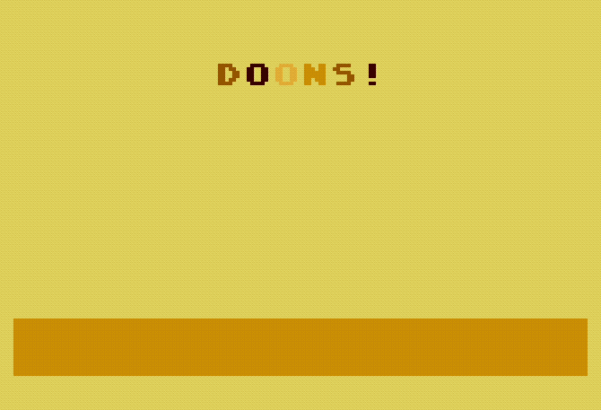

# Doons&nbsp;&nbsp;🏜&nbsp;️💥

By Kim Slawson, February – March 2024

*NOMAM* 2024 10-Line BASIC competition entry (EXTREME-256 category)

Requires an Atari 8-bit machine or emulator running TurboBASIC XL (800XL minimum)

The provided disk image contains TurboBASIC XL and automatically runs the game.

## The pitch&nbsp;&nbsp;📈
Blow up sand dunes (doons) with your cannon!

## To play&nbsp;&nbsp;🕹 💣
Note the color of the doon loaded into your cannon, then use the joystick to position your cannon above the doons you want to clear, and press the trigger to shoot your doon. If you shoot your doon into doons of the same color, the doons will explode. Every now and then, a color-changing bomb will appear to the left of the playfield. If you move the cannon next to the bomb and shoot, it will explode all of the doons of the matching color. Keep playing until the doons overwhelm you! 

## A debt of gratitude&nbsp;&nbsp;🙏
Doons is similar to another shooting color matching game you may have played, just upside-doon 😜

## Colophon&nbsp;&nbsp;🧰
Shoutouts to the following AtariAge users: @dmsc for basicParser, @skr for MacTurban, @luckybuck for Sublime Text integration and @mozzwald and @tschak909 for the amazing FujiNet project.

Thanks to Gunnar for moderating the competition, NOMAM for running it, and all the other entrants for making great games!

## Get in touch&nbsp;&nbsp;📩

  * [OxC0FFEE on AtariAge](https://atariage.com/forums/profile/50996-oxc0ffee/)
  * [OxC0FFEE on Twitter](https://twitter.com/OxC0FFEE)
  * [@0xC0FFEE@oldbytes.space on Mastodon](https://oldbytes.space/@0xC0FFEE)
  * [kimslawson@gmail.com](mailto:kimslawson@gmail.com)

## Last, but not least 👩🏻‍💻

[Check out the repo on Github!](https://github.com/kimslawson/doons/")
